<h1 align="center">
<br>
  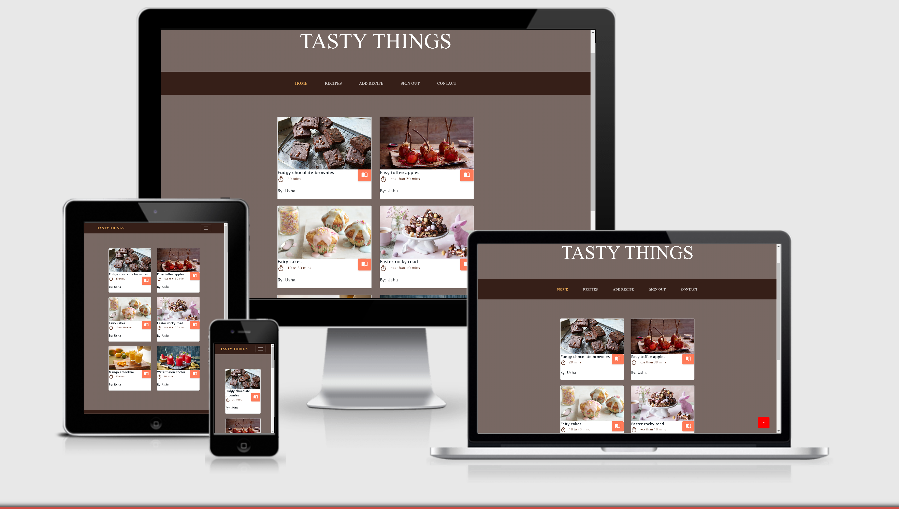
  <br>
    <br>
  Tasty Things - Dine On Demand
  <br>
</h1>

<h3 align="center">Data Centric Development</h3>

<h4 align="center">A Recipe Manager, Accessible Online, Which Enables Users to Create, Read, Update and Delete Recipes</h4>

- [Live link](https://tasty-and-things.herokuapp.com/)
- [Github Link](https://github.com/sree0831/MSP-3.git)
<hr><hr>


## Table of Contents

<!--ts-->

1. [About](#About)

    - [Goal](#Goal)
    -   [Strategy Plane](#strategy)
    -   [Project Charter](#charter)
    -   [Defensive Design](#def)

2. [UX](#UX)

    - [Layout Pro](#Layout-Pro-Boundless-Adaptability)
    - [Layout Con](#Layout-Con-Moderate-Speed-and-Execution)
    - [template style](#template-Style)
    - [Navigation](#Navigation)
    - [Database Structure](#Database-Structure)
    -  [Wireframes](#wireframes)
        

3. [Technologies](#Technologies)

    - [Languages Frameworks Tools](#Languages-Frameworks-Tools)
    - [Other-Resources](#Other-Resources)
    - [Features](#Features)
    - [Features Left To Implement](#Features-Left-To-Implement)
    - [Challenges](#Challenges)


4. [Testing](#Testing)

    - [Tools-and-Methods-Used-for-Testing](#Tools-and-Methods-Used-for-Testing)
    - [Tested Sections 1 HTML & CSS](#Tested-Sections-1-HTML-&-CSS)
    - [Tested Sections 2 Python](#Tested-Sections-2-Python)
    

5. [Deployment](#Deployment)

    - [How the project got deployed to Heroku](#How-the-project-got-deployed-to-Heroku)
    - [How to access the live application](#How-to-access-the-live-application)

6. [Credits](#Credits)

    <!--te-->
## About

 **TastyThings** web application is related to restaurant based recipe site where  users can add ,edit ,delete , access cooking recipes and book a table .

#### Goal

A full stack CRUD application that allows users to register and log in to create, edit, update and delete recipes.

This application uses Python on the back-end with the Flask web framework, and uses MongoDB for the database. It also uses the Materialize framework on the front-end.

Built for Milestone Project no.3 in the Full Stack Software Development at Code Institute, in the Data Centric Development module.

The core focus of this project is on functional app logic created with **Python** while utilising the **Flask** framework and **MongoDB** NoSQL database.
# Strategy Plane
The overall aim of the project is to create a web application that allows users to store and easily access cooking recipes. The logic of the app will be written using a variety of technologies but predominantly using the Python Flask micro framework, jQuery and MongoDB.  HTML, CSS, and JavaScript will be used to enhance the look and feel of the application. 
## Project Charter 
||Objectives |
|:---|:---|
|**Purpose:** What purpose does the website serve?|The web application allows users to store and easily access cooking recipes|
|**Goals:** What outcomes does it need to achieve?|<ul><li>allow users to store and easily access cooking recipes </li><li>editing and </li><li>deleting of recipes</li><li>group and summarise the recipes</li></ul>
|**Target audience:** Whom must the product appeal to and work for?|<ul><li>Casual cooks just browsing for an easy recipe </li><li>Cooking hobbyists</li><li>Professional and semi-professional cooks</li></ul>|
|**Success indicators:** How will you know you have achieved project goals?|A steady increase in the number of recipes added by users would be a clear indication of the success of the application|
|**Strategies:** What approaches will help to realise the goals?|<ul><li>We will take a mobile first approach to Content</li><li>Provide useful, interesting and focused content for our target audience</li><li>Aim to keep the site simple and not over complicated</li><li>Present content in a clear and user-friendly way</li></ul>
|**Tactics:** What activities might help to realise the strategies?|<ul><li>Provide useful and relevant content to users</li><li>Provide a user experience that is accessible and enjoyable for all visitors</li><ul><li>following conventions for design and interaction</li><li>providing clear and consistent navigation</li></ul></ul>

## Defensive Design
Defensive design for TastyThings application will focus on the most common points of failure: user input areas, feedback and server problems.
*	I will employ form validation to check for user 
*	I will protect users from server errors and broken links with informative messages
*	My Defensive design will assist the user before mistakes happen.

The user will be informed if that username has already been taken and asked to enter a different username. The form will have validation and offer clear instructions to users on how to proceed.
Environmental variables have been used to protect access details to the database.

<hr><hr>

## UX
 
This application was built to allow users create and share recipes, as well as updating and deleting them as necessary. The application provides a registration page for new users to register on the site, a log in page to sign in after they have registered and a contact page where users can book a table.
As a user I can:
- register as a user on the site
- log in to the site once registered
- add new recipes to the site (when logged in)
- user with same user and author name can view features of edit and delete in recipes page.(when logged in)
- edit recipes I create on the site (when logged in)
- delete any recipes I created on the site (when logged in)
- view a list of recipes stored on the site
- click on a recipe to see information about the recipe
- read the method for preparing the recipe
- book a table in our restaurant and can plan a visit .


#### Layout Pro 

- Choosing a **multiple page application (MPA)** takes into consideration the choice to make new content and spot it on new pages. Multi-page applications can incorporate as much data as required.
#### Layout Con 

- Being as this is a multi-page application, a server needs to reload most assets, for example, HTML, CSS, and **Python** with each interaction. When loading another page, the browser completely reloads page information and downloads all assets once more, even rehashed segments throughout all pages (for example the header/navigation) which influences Speed and Execution.

#### Template Style

- I opted for the business -casual  framework. As a tool, Bootstrap is excellent to get started, but I feel it cannot create a real quality UI without the need to write a considerable amount of custom CSS to get anywhere close to the look.

#### Navigation

- A navigation bar takes up space and wasn't fixed to top  because of site designing as the title of the site should come first ,so for easy navigation users can use bottom to top icon . That being the case, and that there is a lot of content to display in the form of recipes, etc., 
The navbar will be available to users at the top of the application on every page.
Unregistered users will see links to Sign In,contact and Recipes
Registered users will see links to Sign Out, Recipes, Add Recipe and Recipes.

### Database structure
- I separated my users from the recipes to create two separate entities.
As a recipe document is created in the recipes collection, the author of the recipe (the user who was logged in) is recorded against the recipe under the author field(STR).
**Sample Recipe doc**
```
{"_id":{"$oid":"5efe36b8c56aa8e45ef15430"},
"recipe_name":"Fudgy chocolate brownies",
"author":" Usha",
"recipe_intro":"These lower-fat brownies taste totally lush and are worth every calorie! ",
"ingredients":"400g tin black beans, drained and rinsed (235g/8½oz drained weight)80g/3oz light vegetable oil spread,4 large free-range eggs60g/2¼oz good-quality cocoa powder, plus 1 tsp for dusting50g/1¾oz ground almonds1 tbsp vanilla extract2½ tbsp maple syrup1 tsp instant coffee granules4 tbsp granulated sweetener60g/2¼oz dark chocolate chips",
"description":"Preheat the oven to 180C/160C Fan/Gas 4. Line a 20cm/8in square baking tin with baking paper.Put the black beans and vegetable spread into a food processor and blend until smooth. Add the eggs and blend again briefly, until well combined. Transfer the mixture to a large bowl.Add the cocoa powder, ground almonds, vanilla extract, maple syrup, coffee granules, sweetener and half of the chocolate chips. Whisk to combine evenly.Pour the mixture into the lined tin and sprinkle the remaining chocolate chips over the surface. Bake on the middle shelf of the oven for 18–20 minutes, or until just firm to the touch.Remove from the oven and leave to cool slightly before carefully lifting the brownie out of the tin and cutting it into squares. Enjoy while still warm, sprinkled with a little sifted cocoa.","preparation_time":"20 mins",
"photo_url":"https://ichef.bbci.co.uk/food/ic/food_16x9_1600/recipes/fudgy_chocolate_brownies_64180_16x9.jpg"}
```
**Sample User doc**
```
{"_id":{"$oid":"5effb3c3545eea5dcb08d73c"},
"name":"",
"email":"",
"password":""}
```

##  Wireframes

## Home Page (‘/’ index.html)<a id="homewf"></a>
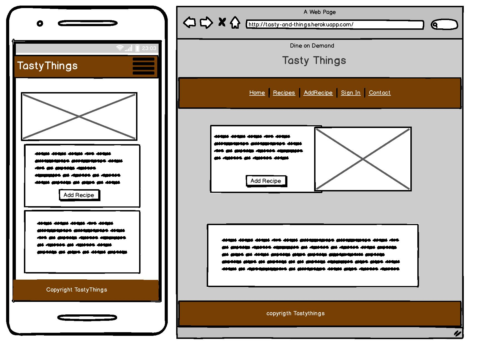

## Register Page (‘/register  register.html)<a id="signwf"></a>
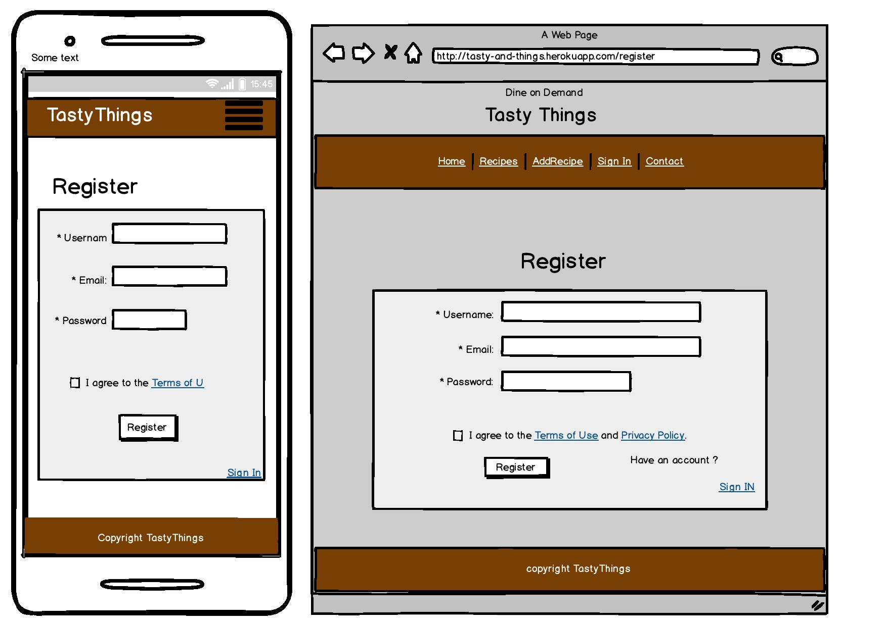

## myrecipes (‘/recipes recipes.html)<a id="mywf"></a>
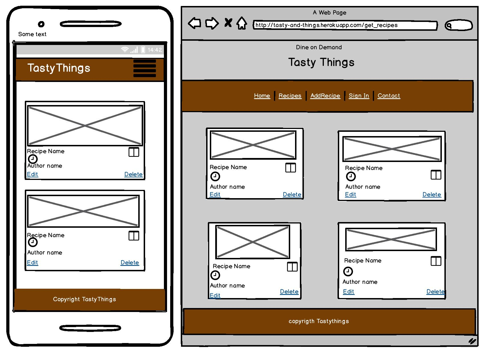

## Add Recipe (/add_recipe add_recipe.html) <a id="addwf"></a>


## Edit Recipe (/edit_recipe edit_recipe.html) <a id="addwf"></a>
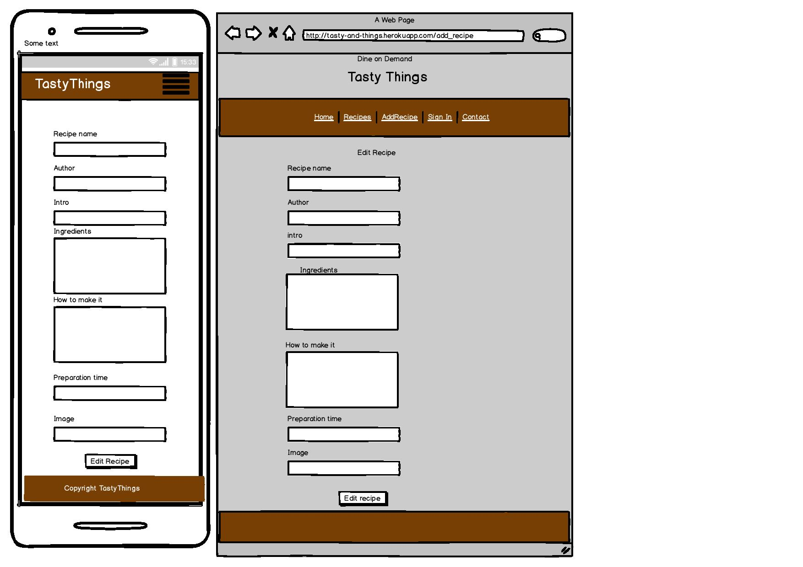


## Technologies

#### Languages, Libraries & Frameworks

- [HTML](https://www.w3.org/TR/html5/ "HTML5 Official Site")
    - is a semantic markup language utilised as the shell of the site.

- [CSS](https://www.w3.org/Style/CSS/ "Cascading Style Sheets Official Site")
    - means Cascading Style Sheets and was used on the design of the site.

- [Python](www.python.org) 
    - This project uses Python as the server-side programming language to provide back-end logic and serve dynamic web pages to the browser.

- [Flask](https://flask.palletsprojects.com/en/1.0.x/) 
    - This project uses Flask as the back-end framework to simplify configuration of the application and routing, to render HTML templates, work with client requests and to assist with user session management.

- [Flask-PyMongo](https://flask-pymongo.readthedocs.io/en/latest/)
    - This project uses **Flask-PyMongo** to connect the application to MongoDB and for retrieving, inserting, updating and deleting data to and from the database.
- [MongoDB](https://www.mongodb.com/) 
    - is a NoSQL database program, to implement a data-store using JSON-like documents with schema. 

- [Jinja2](http://jinja.pocoo.org/docs/2.10/) 
    - was utilised to render HTML templates, imparting between front-end and back-end.

- [jQuery](http://jquery.com/ "jQuery Official Site") 
    - is used for HTML document traversal and manipulation, event handling.

- [javascript](https://www.javascript.com/ "Javascript Official Site") 
    - is used to create responsive, interactive elements for web pages, enhancing the user experience.

- [Materialize icons](https://material.io/resources/icons/?style=baseline "Materialize icons") 
    - is utilised for developing the  Material Design Icons .

- [Bootstrap](https://startbootstrap.com/ "startbootstrap Official Site") 
    - is the main soul of the app which is used as a template with changes across the entire website


#### Other Resources

- [w3schools](https://www.w3schools.com/)
- [CodeInstitute](https://codeinstitute.net/)
- [Slack](https://slack.com/)
<hr><hr>

####  Features

1. Home Page

<br>
  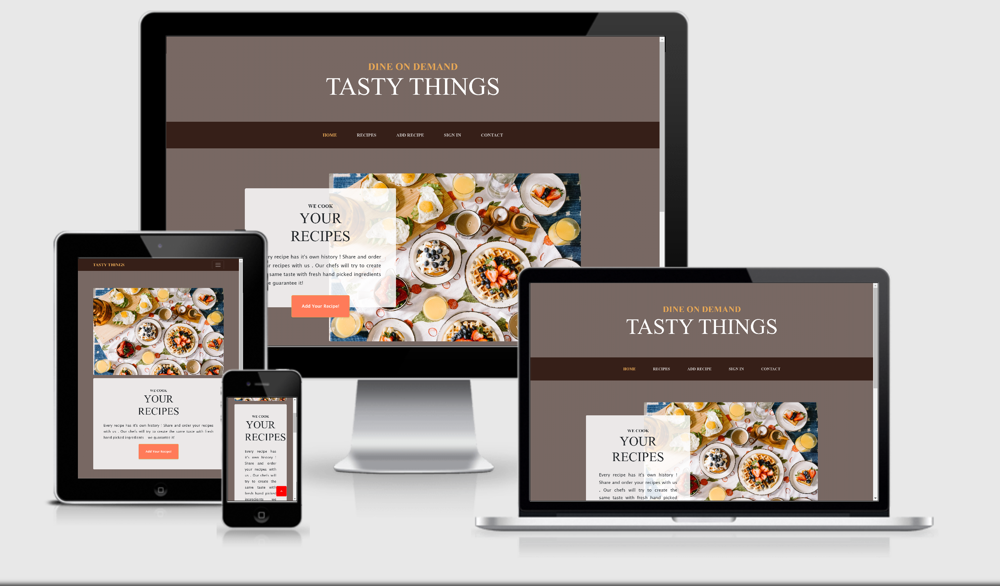
  <br>

  - It is used to access the  add recipe page field which leads the user to login page with little description about the site .
<hr><hr>

 2. Sign Up
<br>
  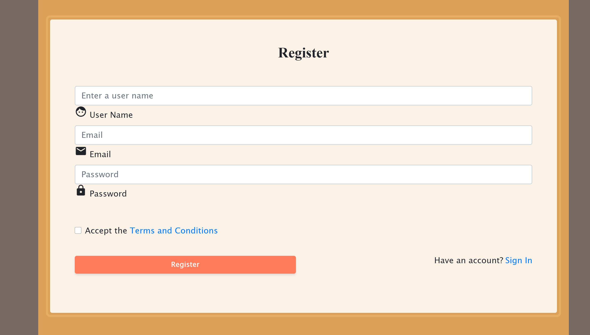
  <br>

  - I have used for a user to register for an account so they can log in into the app.
<hr><hr>

3. Sign In
<br>
  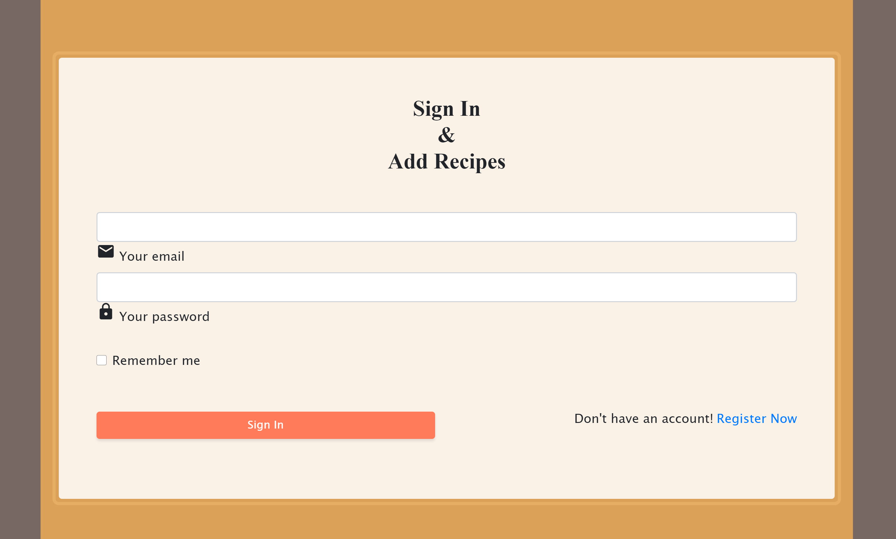
  <br>
  - Used for a user to login to the app so to access and utilise all available features.

4. MongoDB (NoSQL Database)

  - Stores recipe and user objects.
<hr><hr>

5. Add recipe Page

<br>
  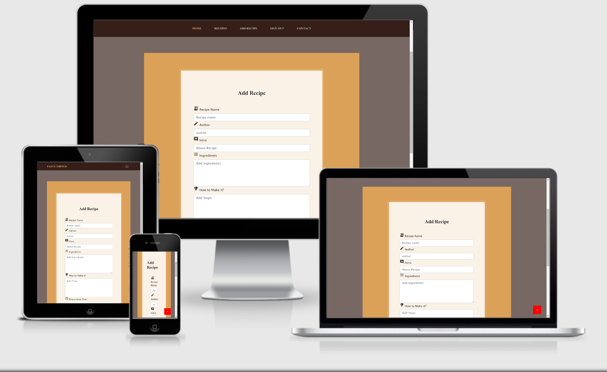
  <br>

  - It is applied for a registered user to create/ add recipe data.
<hr><hr>

6. Recipes Page

 <br>
  
  <br>

  - Allows a  user to read  recipe within the app.

  - Users who created  recipes with  author name same as user name  can see edit and delete feautures in recipe page.
<hr><hr>

7. Edit Page

<br>
  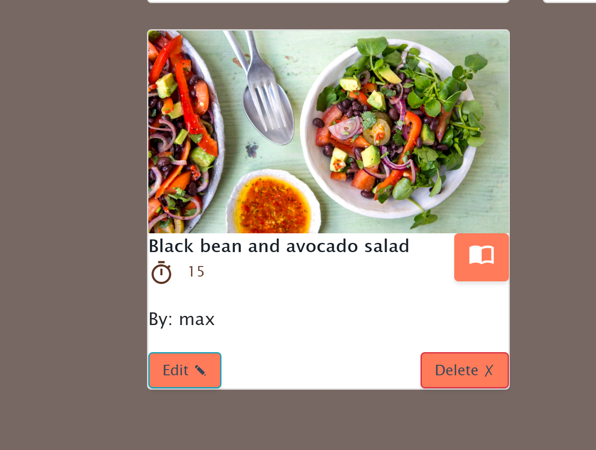
  <br>

  <br>
  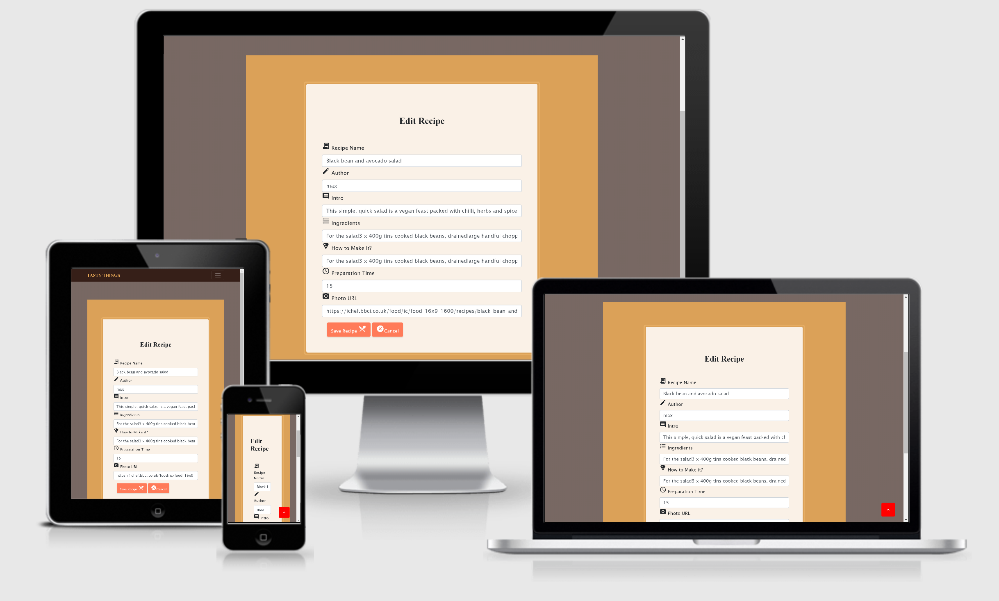
  <br>

  
  - For user to update and delete their own recipe data.
  - Only user who created recipes with same username and  author name can view edit and delete features .
<hr><hr>

8. single Recipe Page

 <br>
  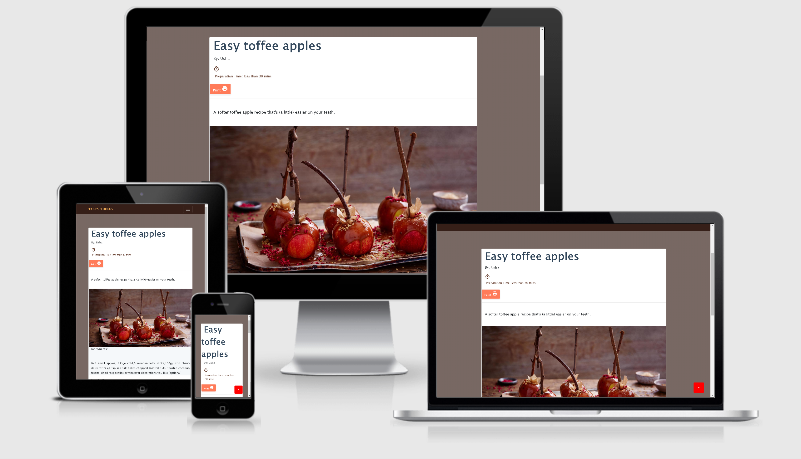
  <br>

  - Allows a  user to read  recipe within the app.
  - users with same username and author name can view options for update and delete.
<br>
  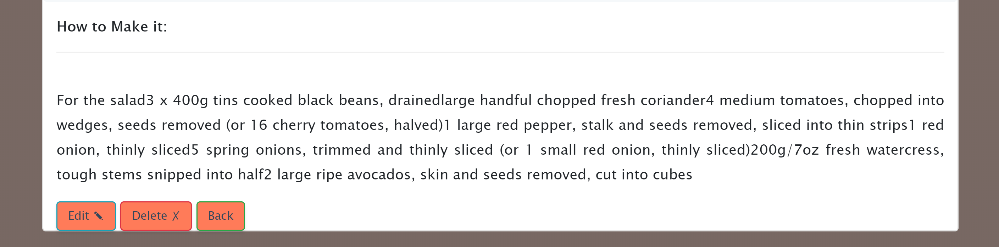
  <br>
<hr><hr>

9. Contact Page

<br>
  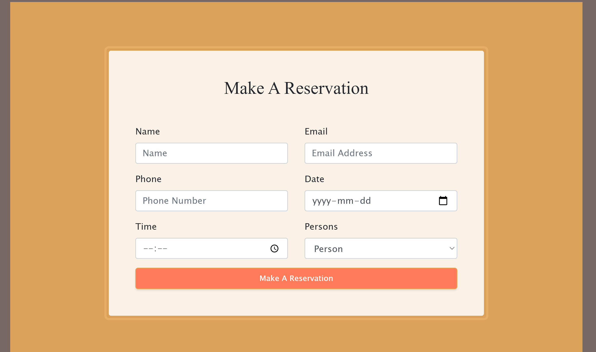
  <br>

  - Allows a user to book a table and see Contact details .
<hr><hr>

10. [Error 404 Page](/app/templates/error404.html)
-  Comprises a custom page not found error.

11. [Error 500 Page](/app/templates/error500.html)
-  Comprises a custom server error.
14. [Base Template](/app/templates/base.html)
* Includes all the scripts and css files that have been used for the construction of the other templates.

#### Features Left To Implement

- A user page where user can see only his recipies.
- A chat could be added so that users could interact with each other.

#### Challenges
- Flask and MongoDB integration was a great learning experience but tricky at times.
- Creating the logic and routes on python has been the biggest challenge for me.


## Testing

#### Tools and Methods Used for Testing

- HTML

  - [Freeformatter](https://www.freeformatter.com/)

  - [The W3C Markup Validation Service](https://validator.w3.org/)

- CSS

  - [The W3C Markup Validation Service](https://jigsaw.w3.org/css-validator)

- Python

  - [Python Formatter](https://pythoniter.appspot.com/)

- Phones

  - Galaxy Note 3 (simulation and actual device)
  - Galaxy Note 9
  - Galaxy S5
  - Galaxy S9/S9+
  - iPhone 5/SE
  - iPhone 6/7/8 (simulated and real device)
  - iPhone 6/7/8 Plus
  - iPhone X
  - LG Optimus L70
  - Microsoft Lumia 550
  - Microsoft Lumia 950
  - Nexus 5X
  - Nexus 6P
  - Nokia 8110 4G
  - Pixel 2
  - Pixel 2 XL

- Tablets
  - iPad (simulation and actual device)
  - iPad Mini
  - iPad Pro (10.5-inch)
  - iPad Pro (12.9-inch) (simulated and real device)
  - Kindle Fire HDX
  - Nexus 10
  - Nexus 7

- Website responsiveness was also tested by resizing .


#### Tested Sections 1 HTML & CSS


- Checked button sizes so, they were responsive and large enough to be clicked.

- Ensured individual section headers resized and appeared well when viewed on various device screens and added opacity to the navigation bar to allow for more visibility of section header area on smaller devices.

- Spell checked all text content.

- HTML and CSS validation via [w3.org](https://www.w3.org/ "W3C Official Site").

- Checked margins and padding of the container (sections) to ensure the content within it did not look disproportionate on various screen sizes, individually smaller devices.

#### Tested Sections 2 Python

Manual testing was embraced for this application and acceptably passed. An example of the tests directed are as per the following:

- Tested route catches and hyperlinks all through the page.
- Tested the rationale of the application by looking at expected conduct against the database record information.
- Tested the responsiveness of the application on various programs and after that utilising multiple gadgets.
 
- max@max  as email , max as username and max as password can be used by visitor to test edit ,add,delete feautures in the app .

## Deployment

#### How the project got deployed to Heroku

1. Make a `requirements.txt` file utilizing the terminal command 'pip freeze > `requirements.txt`

2. Make a `Procfile` with the terminal command `echo web: python run.py > Procfile`

3. `git add` and `git commit` the new prerequisites from the requirements.txt file and Procfile, then 'git push' the undertaking to GitHub. 

4. Go to [Heroku](https://dashboard.heroku.com/) website.

5. Make another application (app) on the [Heroku](https://dashboard.heroku.com/) website by tapping the "New" button on your dashboard. Name your app, followed by selecting Europe as your region. 

6. Select application

7. In the "Deployment Method" section, check to see if the application is already connected to GitHub. If not connected then click the relevant button to link the Heroku website to the dashboard.

8. Affirm the connecting of the Heroku application to the right GitHub repository. 

9. In the application dashboard, click on "Settings" > "Reveal Config Vars". 

10. Set the accompanying config vars.

 To retrieve your MONGO_URI please reference the official MongoDB Atlas documentation [here](https://docs.atlas.mongodb.com/)

11. On the dashboard click "Deploy or alternatively in the "Automatic Deployment" section enable "Automatic Deploys" (optional).

12. In the "Manual Deploy" section, set the branch to "master" then click "Deploy Branch."

#### How to access the live application

- A live demonstration is accessible by clicking [here](http://tasty-and-things.herokuapp.com/ "Live Demonstration: Tasty Things").
## Credits
- All initial recipes (of which there are ten), including their images, were recipes taken from the BBC GoodFood website which can be found [here](https://www.bbcgoodfood.com/recipes)
- Slack and lots of tutorials from web .
- Code Institute lessons.
- CSS and JavaScript libraries.
- For my Mentor who guided me in building this website.
#### Inspiration
- From my 8 year old Daughter who always encourages me with her ideas and suggestions in building this project !

